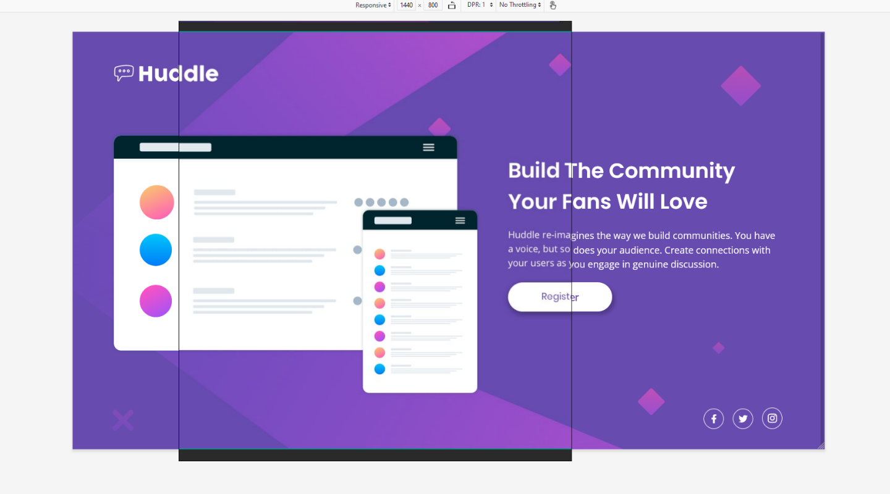

# Frontend Mentor - Huddle landing page with single introductory section solution

This is a solution to the [Huddle landing page with single introductory section challenge on Frontend Mentor](https://www.frontendmentor.io/challenges/huddle-landing-page-with-a-single-introductory-section-B_2Wvxgi0). Frontend Mentor challenges help you improve your coding skills by building realistic projects. 

## Table of contents

- [Overview](#overview)
  - [The challenge](#the-challenge)
  - [Screenshot](#screenshot)
  - [Links](#links)
- [My process](#my-process)
  - [Built with](#built-with)
  - [What I learned](#what-i-learned)
  - [Continued development](#continued-development)
  - [Useful resources](#useful-resources)
- [Author](#author)


## Overview

### The challenge

Users should be able to:

- View the optimal layout for the page depending on their device's screen size
- See hover states for all interactive elements on the page

### Screenshot


### Links

- Solution URL: (https://hamzzei.github.io/)
- Live Site URL: (https://github.com/hamzzei/huddle-landing-page)

## My process

### Built with

- Semantic HTML5 markup
- CSS custom properties
- CSS Grid
- Mobile-first workflow

### What I learned

The project used CSS Grid to create a layout that I had a high amount of control over. I was pleased with how responsive I managed to make the page when scaling between the two sizes. This was done by adding several min() Math functions through the code rather than setting fixed sizes. I would have used relative units instead of this method (such as vh/vw or %) if I hadn't got such specific reference designs that I was trying to match. 

By using min() I could choose a relative unit for scaling, and then declare that once a certain viewport size had been reached, the item would display at a fixed size.

```css
#img_section {
  width: min(50vw, 44.4rem);
}
```

The most challenging part of this build was getting everything to line up as it does in the reference designs. If this were a project that I was working on without such a specific final design to match, I think I would have settled on many aspects of the page much sooner than I did in this project. 

I used a program called PureRef to group all my reference designs onto one page and make it easier to switch between them. Later I found that by scaling the reference designs to the same size as my design in Firefox, I could overlap the PureRef window on top of my design and compare the two to quite a high level of accuracy. 



It took a long time to adjust my design to match both the mobile and the desktop references, but I am pretty happy with the final outcome even if it is still not 100% perfect.

### Continued development

Overall I'm happy with the final outcome of this project, but there are still things I want to continue improving on. I needed to look up reference documents on Font Awesome's website to work out how to use the icons properly, which hopefully I won't need to do as much after using them in more projects. 

I also needed to look up some properties regarding the background images, for example I didn't know about background-attachment until I looked it up on w3schools. I will aim to commit more of the background-image properties to memory as I use them in more projects.

While I overall aimed to build the project using a mobile-first workflow, I got into some issues by moving on too quickly to building the desktop design before realising that the mobile design needed to be tweaked. After correcting the mobile design, the desktop design that I had spent a long time on getting just right was now misaligned again, and so I had to fix that, too. 

In future projects I aim to work more methodically, making sure that the mobile design is correct before moving on, and by doing this I hope that my overall build time will be reduced.

### Useful resources

- [Font Awesome (sizing icons info)](https://fontawesome.com/v5.15/how-to-use/on-the-web/styling/sizing-icons) - Font Awesome's website has some very useful docs on how to get the most out of their icons. 
- [PureRef](https://www.pureref.com/) - Along with the Responsive Design Mode in Firefox, PureRef was incredibly useful for helping me align my own page with the reference images.
-[w3schools (background-image properties)](https://www.w3schools.com/cssref/pr_background-image.asp) - w3schools is always my go-to resource when I am unsure on how to properly use a property.

## Author

- Website - [hamzzei](https://hamzzei.github.io/)
- Frontend Mentor - [@hamzzei](https://www.frontendmentor.io/profile/hamzzei)
